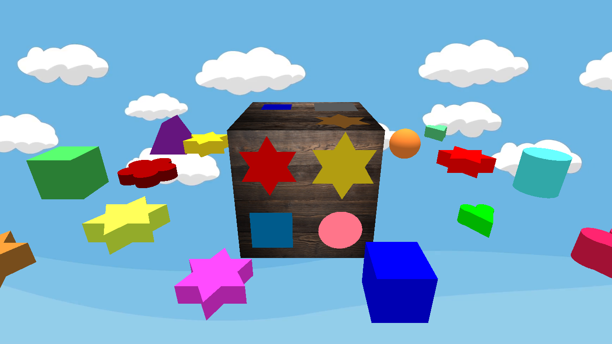

# :cloud: Shapes and colors 

## Opis igre

- Nezaboravna, stara dečija igračka uz koju su deca nekada učila oblike i boje. Nekada drvena, danas digitalna.
Osnovna ideja igrice je pomoć maloj deci u razvijanju logičkog razmišljanja.

- Pri svakom pokretanju igrice, na slučajan način se iscrtavaju oblici i boje različitim bojama.

- Cilj je ubaciti sve oblike obojene različitim bojama, koji su raspoređeni oko drvene kocke, u odgovarajuća mesta na drvenoj kocki.

## :video_game: Komande

- Pritiskom na <kbd>left</kbd> i <kbd>right</kbd> dugmiće bira se oblik za ubacivanje. Oblik koji je trenutno selektovan
kreće se gore-dole odnosno "skakuće". Biranje se vrši pritiskom na <kbd>space</kbd>. 

- Kada je odabran oblik, treba pronaći odgovarajući oblik na drvenoj kocki. Da bi se on pronašao kocka se rotira držanjem pritisnutog levog tastera miša i prevlačenjem.

- Kada je pronađen odgovarajući oblik na kocki, pritiskom na <kbd>left</kbd> i <kbd>right</kbd> dugmiće bira se oblik na kocki. Oblik koji je trenutno selektovan okreće se oko svoje ose. Biranje se ponovo vrši pritiskom na <kbd>space</kbd>. 
Ako su dobro upareni oblici, oni nestaju i prelazi se na biranje sledećeg oblika za ubacivanje.

- Pritiskom na <kbd>up</kbd> uveličava se slika, a na <kbd>down</kbd> slika se smanjuje.

- Pritiskom na <kbd>R</kbd> slika se vraća u početni položaj.

## Kraj igre

- Kada se ubace svi oblici, drvena kocka počne od sreće da se okreće u prostoru. :blush:

